# WatchaGotchi

A complete, original Tamagotchi-style virtual pet that **is** the firmware of a
**SenseCAP Watcher** (ESP32-S3, round 412×412 touch LCD, rotary knob, speaker,
RGB LED). Built on ESP-IDF v5.2.1 + LVGL 8.4. Faithful to the 1996 original's
rules — hearts, discipline, poop, sickness, evolution branches, and yes, death —
with original pixel-art characters and device-native charm (chirps, LED moods,
a circular icon ring made for the round screen).

> This repo previously held **WatcherOS** (radar/timer/WiFi apps). That code was
> removed when the device was repurposed; see `docs/HANDOFF.md` and git history
> (`git log --before=2026-08-16`) for the archaeology.

## Screenshots
Rendered by the headless simulator from the same `tama_ui.c` the device runs —
`sim_screens` plays one whole life (first boot → death) and dumps every screen:

| First boot | Egg | Attention + poop | Feed |
|:---:|:---:|:---:|:---:|
| 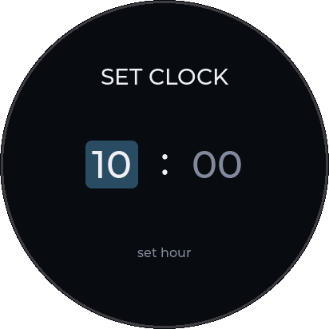 | 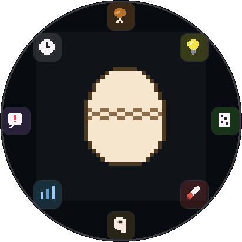 | 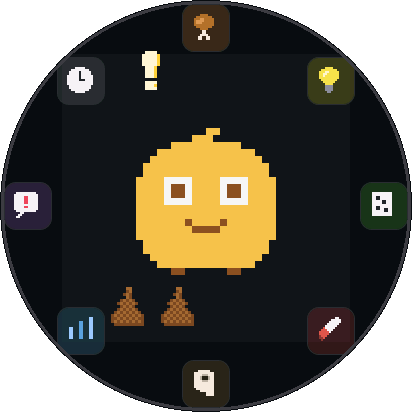 | 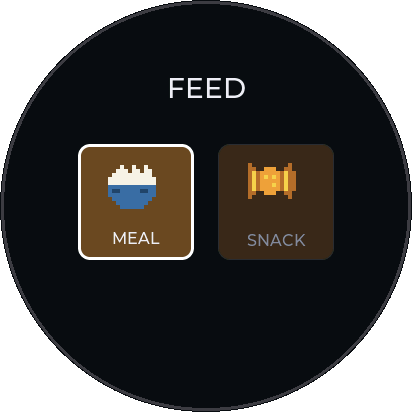 |

| Game | Status | Sick | Sleeping |
|:---:|:---:|:---:|:---:|
| 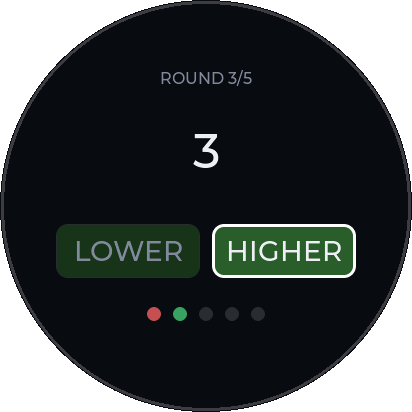 | 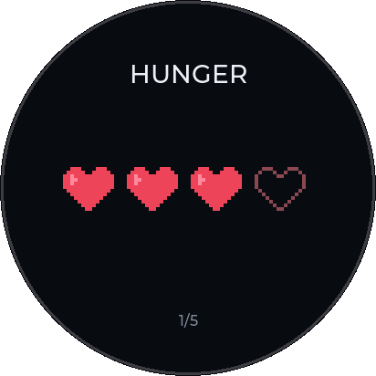 | 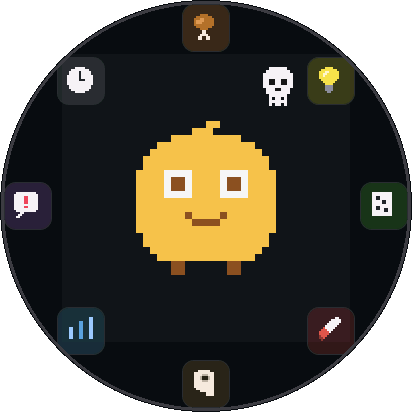 | 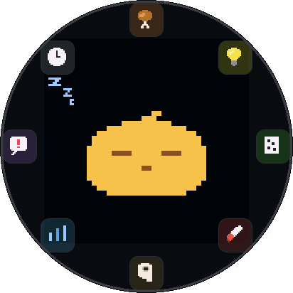 |

| Evolving | Adult (HERO) | Death | Clock |
|:---:|:---:|:---:|:---:|
| 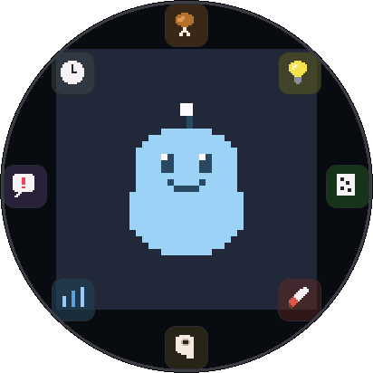 | 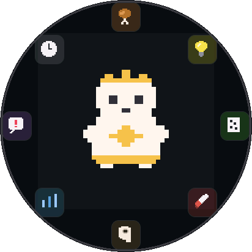 | 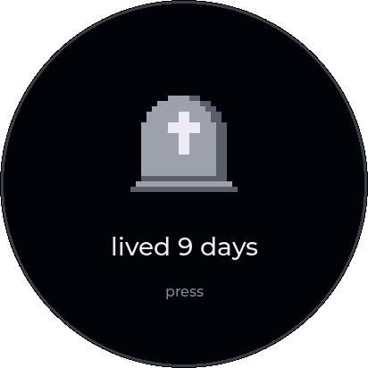 | 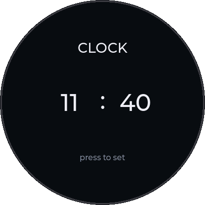 |

The full set lives in `docs/shots/`.

## Status (phases)
- ✅ **Phase 0** — Tamagotchi-only skeleton: icon ring, input, sfx/LED task, battery/RTC diagnostics
- ✅ **Phase 1** — sprite pipeline (28 sprites) + headless simulator
- ✅ **Phase 2** — core game loop: hunger/happy, feed, poop/clean, NVS save, pet clock (code + sim-verified)
- ✅ **Phase 3** — full lifecycle: sleep/lights, discipline, sickness, higher-lower game, evolution branches, death → new egg (code + sim-verified; `sim_life` bots prove every branch)
- 🔶 **Phase 4** — polish: jingles, LED moods, cinematics, secret character, battery page all implemented; **on-device verification pending** (this container has no flash access — see `docs/HANDOFF.md` for the device checklist)

The full design + plan: `docs/PLAN.md`; current state + handoff: `docs/HANDOFF.md`.

## Controls
- **Knob** — rotate the selection around the icon ring
- **Press** — activate / confirm
- **Long-press** — back / cancel
- Touch only wakes the dimmed screen (v1 is knob-driven, like the original's buttons)

## Architecture (the rules that keep it stable)
- **LVGL draw buffer in INTERNAL DMA RAM, never PSRAM** — a PSRAM draw buffer
  stalls the QSPI flush and hangs the UI (~28 s in). See `bsp_display_cfg_t` in
  `tama_main.c`. Sprite/canvas *source* buffers live in PSRAM (CPU-copied — fine).
- **The LVGL task owns all UI**; one 80 ms `lv_timer` applies input flags and
  drives animation. Input callbacks only set flags (knob is burst-gated).
- **Audio + LED live in `fx_task`** (`tama_sfx.c`), queue-fed; I2S is stopped
  when idle.
- **Game logic is pure C** (`tama_logic.c`, no LVGL/ESP includes): the caller
  injects pet-epoch seconds; every scheduled event is an absolute epoch, so
  power-off = hibernation with zero catch-up code.

## Layout
```
main/tama_main.c     device entry: BSP/LVGL/NVS init, input, diag, port impl
main/tama_ui.c/h     ALL rendering (portable; runs on device AND in the sim)
main/tama_logic.c/h  pure-C game state machine (portable, unit-testable)
main/tama_sfx.c/h    fx task: tone synth jingles + LED moods
main/tama_sprites.*  GENERATED sprite data — do not hand-edit
main/tama_port.h     seam between portable code and the device/sim
assets/sprites/*.txt ASCII pixel art (source of truth for all art)
tools/spritegen.py   ASCII art -> tama_sprites.[ch]
sim/                 headless PC simulator -> round PNGs in docs/
```

## Build & flash (macOS)
Requires the WCH CH34x VCP driver (the built-in macOS driver corrupts bulk
writes — flashing fails without it). Toolchain: ESP-IDF v5.2.1 at `~/esp/esp-idf`,
BSP clone at `~/esp/SenseCAP-Watcher-Firmware`.

```sh
. ~/esp/esp-idf/export.sh
export CMAKE_POLICY_VERSION_MINIMUM=3.5   # cmake 4.x vs old rlottie component
idf.py build
idf.py -p /dev/cu.wchusbserial56D50556323 -b 460800 flash
```

Don't `erase-flash` after Phase 2 — the pet's save lives in NVS (namespace
`tama`). Factory reset without erasing: **hold the knob while plugging in**.
Demo build (1 real minute = 1 pet-hour): `TAMA_TIME_SCALE=60 idf.py build`.

## Art pipeline
Draw/edit ASCII art in `assets/sprites/*.txt`, then:
```sh
python3 tools/spritegen.py     # regenerates main/tama_sprites.[ch]
```

## Simulator
```sh
cd sim
./build.sh        # compiles the real tama_ui.c + LVGL 8.4 -> ./sim_screens
./sim_screens     # renders scenes to out_*.565
python3 render.py # -> round PNGs in ../docs/
```

## Battery note
The stock 3.7 V 400 mAh pack (model **403035**, JST ZH 1.5 mm 3-pin with NTC)
reads *not present* on this unit — the device runs on USB-C only until the pack
is re-seated or replaced. Details in `docs/HANDOFF.md`.
